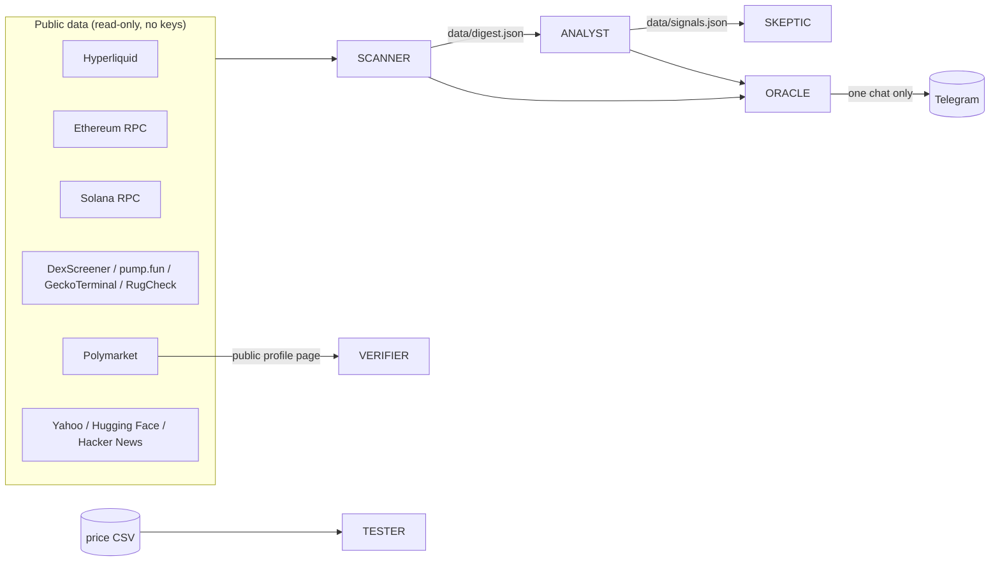

# Luthor Lab

A read-only crypto market research lab built from small AI-agent roles. It pulls public data
from Hyperliquid, Ethereum, Solana, DexScreener, pump.fun and Polymarket, turns it into plain-language
signals, and gives you the tools to check a trading idea before you believe it.

No API keys. No accounts. No trading. No posting. By default everything only reads public data.


## The agents

| Agent | What it does | Needs |
|-------|--------------|-------|
| **SCANNER** | Collects public market data into `data/digest.json` and prints a short summary | Python 3.11+ only |
| **ANALYST** | Turns findings into signals (cap vs pool, distance to liquidation, wallet age, biggest win vs profile total) and flags numbers that have no source | Python only |
| **TESTER** | Six-filter checklist for trading ideas and a walk-forward template for any price CSV | Python only |
| **VERIFIER** | Records a public Polymarket profile as seen on an iPhone and (optionally) has a model check the frames | Playwright, ffmpeg; Claude Code optional |
| **SKEPTIC** | Sends a finding to a separate, tool-less model call that looks for the weakest point | Claude Code (optional) |
| **ORACLE** | Telegram bot locked to one chat: scan summaries on a schedule and on `/scan` | Telegram bot token (optional) |



## What it catches

The scanner does not invent anything: every number comes from an API response and every finding
has a link you can open. Sections of `data/digest.json`:

- **perps.hyperliquid** - largest and riskiest open positions of top accounts (size, leverage, entry,
  liquidation price, distance to liquidation, unrealized P&L), perp P&L leaders and losers for 24h / 7d.
- **perps.eth_transfers** - USDT/USDC transfers of $20M+ over ~6 hours with public exchange labels;
  mints, burns, flash loans filtered out, A -> intermediary -> B chains merged.
- **memes** - sharpest 24h / 1h moves on Solana and Base with liquidity filters, "paper" market caps
  (cap 100x+ the pool), pump.fun launch rate and graduations, holder concentration, identical-balance
  wallet clusters, live mint/freeze authority.
- **polymarket** - daily and weekly leaders with numbers taken from the public profile (not the
  leaderboard), big bets in the last 24h.
- **signals** - Polymarket wallets younger than 14 days with $50K+ realized, big cheap bets followed by
  a sharp price jump, biggest losers, celebrity markets, stock moves of 5%+, trending AI models and stories.

Console summary format (`python -m lab.scan`):

```
Luthor Lab scan - <UTC time> - <seconds> s - read-only public data
===================================================================

Hyperliquid whale positions
  - <Long|Short> <COIN> $<size> at <lev>x, <up|down> $<pnl> right now; ...
    www.coinglass.com/hyperliquid/<address>

Paper market caps (cap >= 100x pool)
  - <SYM>: market cap $<cap> on paper vs $<pool> in the pool (<N>x); ...
    dexscreener.com/solana/<pair>

Polymarket: fresh wallets with big wins
  - <name>: Wallet is <N> days old and has already realized +$<amount>; biggest win ...
    polymarket.com/@<name>
...
Saved: data/digest.json
```

Signals format (`python -m lab.analyst`):

```
[***] cap_vs_pool: <SYM>: market cap $<cap> is <N>x the $<pool> liquidity pool
      why: The cap is price x supply, not money anyone can take out. ...
      source: dexscreener.com/solana/<pair>
[***] win_vs_total: <name>: biggest win +$<win>, but the all-time profile total is -$<total>
      why: One winning trade says nothing about the trader. ...
      source: polymarket.com/@<name>
```

## Quick start

```bash
git clone <this-repo-url> luthor-lab && cd luthor-lab
python3 -m lab.scan --dry        # offline self-check, no network
python3 -m lab.scan              # real scan, about a minute, writes data/digest.json
```

Then:

```bash
python3 -m lab.analyst                        # signals from the last scan
python3 -m lab.analyst demo                   # how the unsourced-number check works
python3 -m lab.tester.walkforward --demo      # watch an in-sample "edge" die out-of-sample
```

The core needs nothing but Python 3.11+. Optional parts (VERIFIER, ORACLE, SKEPTIC) are described
step by step in [SETUP.md](SETUP.md).

## Ask your AI to install it

Paste this into Claude Code, Codex or a similar coding assistant, opened in an empty folder:

```text
Clone <this-repo-url> into ./luthor-lab and set it up for me.
Read AGENTS.md first and follow it exactly.
1. Check that Python 3.11+ is available and create a virtual environment in .venv.
2. Run `python -m lab.scan --dry`, then a real `python -m lab.scan`, then `python -m lab.analyst`
   and `python -m lab.tester.walkforward --demo`. Show me the output.
3. Do not add API keys, wallets or trading code. Do not enable ORACLE_ALLOW_CLAUDE.
   Do not install system services or cron jobs unless I confirm.
4. If I want the Telegram bot, create .env from .env.example and tell me which two values
   to fill in myself; do not ask me to paste the token into this chat.
Summarize what works and what was skipped.
```

## Safety

- **Read-only.** The scanner only sends public GET requests and read-only JSON-RPC calls
  (`eth_getLogs`, `getTokenSupply`, Hyperliquid `info`). It never signs anything.
- **No keys for data.** No API keys, accounts or logins are needed for any data source.
- **No trading.** There is no code that places orders, holds a wallet or moves funds.
- **No posting.** Nothing is published anywhere. The only outbound message path is ORACLE, and
  only to the one chat you configure.
- **Bot locked to one chat.** ORACLE ignores every chat except `TELEGRAM_CHAT_ID`, ignores old
  messages after a restart, and never replays commands.
- **Claude execution is off by default.** With `ORACLE_ALLOW_CLAUDE=0` (default) the bot only runs
  the scanner. See the warning below before turning it on.
- **Secrets stay local.** `.env` and `data/` are in `.gitignore`. Never commit them.

> **Warning: ORACLE_ALLOW_CLAUDE=1**
>
> This forwards free-text messages from your chat to Claude Code on your machine.
> - `ORACLE_CLAUDE_MODE=readonly` (default when enabled): Claude can only read files in the repo
>   (Read, Grep, Glob). It cannot run commands or change anything.
> - `ORACLE_CLAUDE_MODE=full`: Claude can run **any command** on this machine with your user's
>   permissions. Anyone who gets access to your Telegram account or chat can do the same.
>
> In both modes the system prompt forbids trading, touching keys and posting, and requires Claude to
> describe any irreversible step and wait for an explicit "yes" before doing it. A prompt is not a
> sandbox: use `full` only on a machine you are ready to lose, never on one that holds keys or funds.

## Limitations

- Public APIs change and rate-limit. A failing source shows up as an `error` field and in the summary;
  the rest of the scan still completes within its time budget (default 75 s).
- The Solana public RPC blocks `getTokenLargestAccounts` on the free tier; holders come from a public
  keyless gateway or RugCheck when those answer.
- Hyperliquid's leaderboard is cached (about an hour); positions and P&L are read live per account.
- Polymarket profile numbers are what the profile page shows; the leaderboard is used only to find
  wallets. A young wallet's period P&L is its all-time total.
- Signals are prompts to check something, not trade ideas. Nothing here is financial advice.
- The unsourced-number check allows rounding and sums of two source numbers, so against a large
  source (a whole digest) a wrong number can match by chance. Check against the finding itself.
- VERIFIER depends on the current layout of polymarket.com and may need selector updates.
- TESTER's template rule is deliberately simple. Fees, slippage and the t-stat bar are parameters;
  set them for your venue.

## Layout

```
lab/
  scan.py               python -m lab.scan
  net.py, config.py     shared HTTP helpers (time budget), settings from .env
  scanner/              perps.py, memes.py, polymarket.py, signals.py
  analyst/              numbers.py (unsourced numbers), signals.py (plain-language signals)
  tester/               README.md (six filters), walkforward.py
  verifier/             proof.py (phone recording + frame check)
  skeptic/              second opinion via `claude -p` without tools
  oracle/               Telegram bot (bot.py, tg.py)
  agents16/             pixel agents for visuals (agents16.js + index.html demo)
examples/               cron and systemd templates
```

## License

MIT, see [LICENSE](LICENSE). Data belongs to its sources; respect their terms and rate limits.
